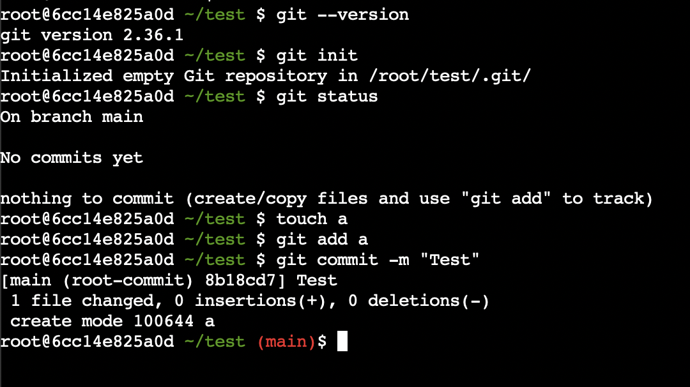

# Web-Terminal for testing purposes in Docker-Container

You can use this container for example in training courses so that participants can easily test the instructions for example for git.

The project is based on [butlerx/wetty](https://github.com/butlerx/wetty).



## Installation

```sh
docker-compose up -d --build
```

## Upgrade

```sh
docker-compose pull
docker-compose up --force-recreate --build -d
docker image prune -f
```

## Usage

Go to [http://localhost/wetty](http://localhost/wetty) in your browser.
